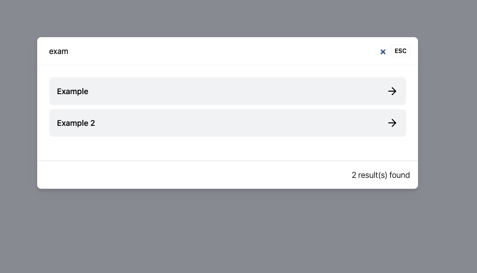

# Search Modal

This is a simple search modal that can be used in any project. It is built with vanilla JavaScript and CSS.

## Installation 

`yarn add search-modal` or `npm install search-modal`

## Configuration 
```js
const button = document.querySelector('button.open-search-modal');
    const instance = window.SearchModal({
        // initialize the search modal 
        autoInit: true,
        searchUrl: "", // to search from server 
        searchKey: "query",
        // only applicable when the `searchUrl` is not provided, to search from static data or preloaded data 
        data:[
            {
                title: "Example",
                category: "Category",
                summary: "Summary of example one",
                url: "/example"
            },
            {
                title: "Example 2",
                category: "Category",
                summary: "Another brief example",
                url: "/example-2"
            }
        ],
        // transform the data 
        transform: (data) => data.map(item=>({
            title: item.title, 
            category: item.category, 
            excerpt: item.summary, 
            url: item.url,
        })),
        callback: (event, data) => {
            console.log({ event, data });
        }
    });
    button.addEventListener('click', () => {
        instance.open();
    });
```

## unpkg usage by @dandv
```

<link rel="stylesheet" href="https://search-modal.msar.me/dist/style.css">
<script type="module">
  import SearchModal from 'https://unpkg.com/search-modal?module';
  const instance = SearchModal({ ... });

  // Activate on Cmd/Ctrl+K
  document.addEventListener("keydown", (event) => {
    if ((event.ctrlKey || event.metaKey) && event.key === "k") {
      event.preventDefault();
      instance.open();
    }
  });
</script>

```

## Example 
 

[Demo](https://search-modal.msar.me/)

## To Do 

- Add documentation
- Proper example 

## History 
This project was inspired from by algolia DocSearch modal which is tightly binded with algolia, that's why we write this package to provide smooth search experience.
The design provided by [Atiqur Rahman](//github.com/atiq-ur) and developed by [Saiful Alam](//github.com/4msar)

